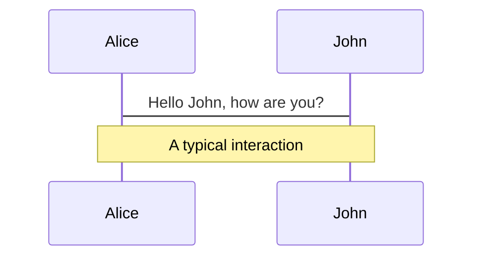
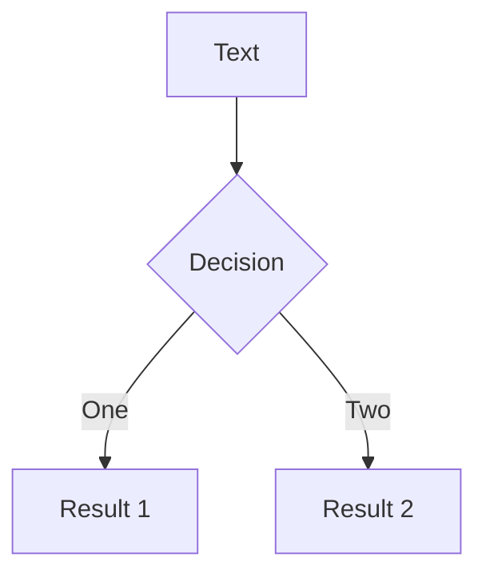
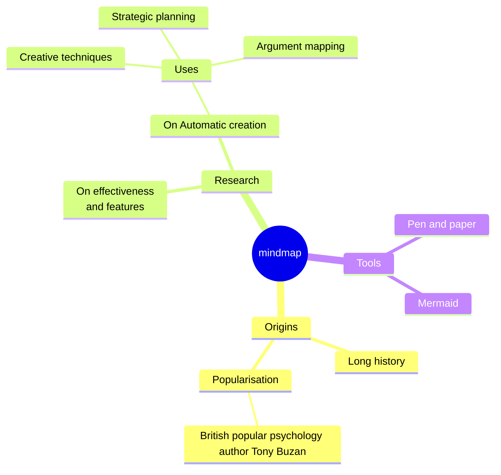
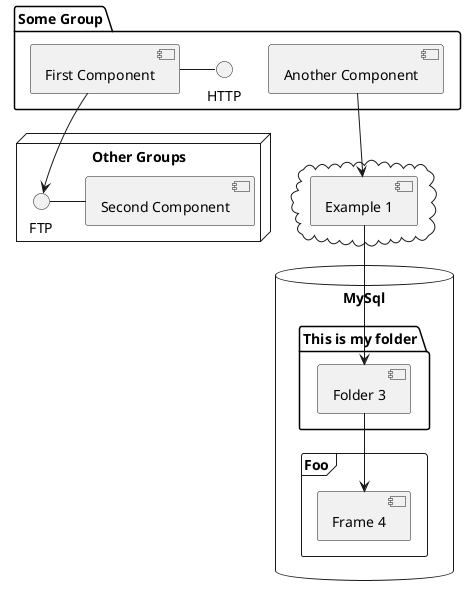

---
# You can also start simply with 'default'
# theme: seriph
# theme: eloc
# random image from a curated Unsplash collection by Anthony
# like them? see https://unsplash.com/collections/94734566/slidev
background:
  # https://cover.sli.dev
  # some information about your slides (markdown enabled)

title: Welcome to Markdown
info: |
  ## Slidev Starter Template
  Presentation slides for developers.

  Learn more at [Sli.dev](https://sli.dev)
# apply unocss classes to the current slide
class: text-center
# https://sli.dev/features/drawing
drawings:
  persist: false
# slide transition: https://sli.dev/guide/animations.html#slide-transitions
transition: slide-up
# enable MDC Syntax: https://sli.dev/features/mdc
mdc: true
# take snapshot for each slide in the overview
overviewSnapshots: true

# highlighter: shiki
---

# Welcome to Markdown

Markdown是一种广泛使用的轻量级标记语言

<div class="pt-12">
  <span @click="$slidev.nav.next" class="px-2 py-1 rounded cursor-pointer" hover="bg-white bg-opacity-10">
    让我们开始吧 <carbon:arrow-right class="inline"/>
  </span>
</div>

---

# **什么是Markdown？**

<center></center>
<br>
<center>上图是Markdown的Logo</center>

**Markdown 是一种轻量级的标记语言**，它允许人们**使用易读易写的纯文本格式编写文档**，然后**转换成有效的XHTML（或者HTML）文档**。Markdown 的核心目标之一是实现“易读易写”，即使在没有格式转换的情况下也能被阅读。 

说人话就是：**Markdown语法简单，好掌握，兼容性强，在哪儿都能用得到**。

<style>
h1 {
  background-color: #2B90B6;
  background-image: linear-gradient(45deg, #4EC5D4 10%, #146b8c 20%);
  background-size: 100%;
  -webkit-background-clip: text;
  -moz-background-clip: text;
  -webkit-text-fill-color: transparent;
  -moz-text-fill-color: transparent;
}
p {
  font-size: 1.4em;
  line-height: 1.5;
}
</style>

---
layout: center
---

# 那么...

---
layout: center
transition: slide-left
---

# Markdown可以**干什么**？

---
layout: two-cols
layoutClass: gap-16
transition: slide-up
---

**下面就是一段Markdown代码** 

<div class="scroll">

````markdown

# 一个井号是一级标题

## 这是二级标题

这是一段正文内容

>也有引用。引文出处可以适当增加尾注[^1]

这是一段*歪斜的*或者**加粗的**或者***加粗倾斜的***正文内容

#### 1.1.1.1 也有多级标题

- 可以构建**列表**
- 也可以构建下面的**有序列表**

1. 当然有数学公式 $1^{2x + 8}\equiv 1$
2. 也有段内代码：`console.log('hello world')`

以及**大段代码**： 
```c
#include <stdio.h>
int main() {
  printf("Hello World");
  return 0;
}
```

还可以**引用图片**：


Markdown也支持html代码直接嵌入（这里**嵌入一个视频**）：

<iframe src="https://player.bilibili.com/player.html?isOutside=true&aid=812371035&bvid=BV1g34y1j7e5&cid=739670424&p=1"  width="360" height="240"  scrolling="no" border="0" frameborder="no" framespacing="0" allowfullscreen="true"></iframe>

[^1]: 尾注 1 的内容。


````

</div>

::right::

**这是它被渲染后的样子：**

<div class="scroll">

# 一个井号是一级标题

## 这是二级标题

这是一段正文内容

>也有引用。引文出处可以适当增加尾注[^1]

这是一段*歪斜的*或者**加粗的**或者***加粗倾斜的***正文内容

#### 1.1.1.1 也有多级标题

- 可以构建**列表**
  - 和**多级列表**
- 也可以构建下面的**有序列表**

1. 当然有数学公式 $1^{2x + 8}\equiv 1$
2. 也有段内代码：`console.log('hello world')`

以及**大段代码**： 
```c
#include <stdio.h>
int main() {
  printf("Hello World");
  return 0;
}
```

还可以**引用图片**：


Markdown也支持html代码直接嵌入（这里**嵌入一个视频**）：

<iframe src="https://player.bilibili.com/player.html?isOutside=true&aid=812371035&bvid=BV1g34y1j7e5&cid=739670424&p=1"  width="360" height="240"  scrolling="no" border="0" frameborder="no" framespacing="0" allowfullscreen="true"></iframe>

[^1]: 尾注 1 的内容。


</div>

<style>
  .slidev-layout {
    .scroll {
      @apply overflow-y-scroll max-w-5/5 max-h-[360px];

      p {
        @apply m-0;
      }
    }
  }
</style>


---
layout: center
transition: slide-left
---

# Markdown**还**可以**干什么**？


---
transition: slide-left
---

# Markdown可以**绘制表格**

|     |     |
| --- | --- |
| <kbd>right</kbd> / <kbd>space</kbd>| next animation or slide |
| <kbd>left</kbd>  / <kbd>shift</kbd><kbd>space</kbd> | previous animation or slide |
| <kbd>up</kbd> | previous slide |
| <kbd>down</kbd> | next slide |

<br>

注: **复杂表格的绘制往往需要使用html超文本标记语言**。

---
transition: slide-left
---

# 也可以**绘制图表**

<div class="grid grid-cols-4 gap-5 pt-4 -mb-6">









</div>

<br>
<br>
<br>

注: 这里使用的是文本绘图工具 **Mermaid** 和 **PlantUML**

---
transition: slide-left
---

# Markdown可以**制作博客**

<iframe src="https://ucas-ctf.github.io/" width="100%" height="400" frameborder="0"></iframe>


---
layout: center
---

# 对了

---
layout: center
---

# 这个**PPT**

---
layout: center
transition: slide-right
---

# 也是基于Markdown完成的😎

---
transition: slide-left
---

<div class="chat">

  <p class="left">Markdown能<b>支持这么多格式、内容</b></p>

  <p v-click class="left"><b>那我应该到哪里去学习Markdown呢？</b></p>

  <p v-click> 别急，我<b>马上向您介绍！</b> </p>

</div>

<style>
  .slidev-layout {
    h2 {
      @apply mb-9;
    }

    .chat {
      @apply w-full max-h-[660px] pb-[100px];
      @apply flex flex-col justify-start;

      p {
        @apply relative self-end m-6 px-5 py-3; 
        @apply rounded-[32px] bg-[#eee];
        font-size: 24px;

        &.left {
          @apply self-start;
        }

        &::before {
          content: '';
          @apply absolute top-2 -left-3 w-5 h-8;
          @apply border-b-[16px] border-solid border-[#eee] rounded-bl-full;
        }

        &:not(.left)::before {
          left: unset;
          @apply -right-4 rounded-none rounded-br-full;
        }
      }
    }
  }
</style>


---
transition: slide-right
---

# **Markdown的学习资源**：

- [**Markdown 语法参考**](https://www.markdown.cn/docs/tutorial-basics/basic-syntax): https://www.markdown.cn/docs/tutorial-basics/basic-syntax
- [**在VSCode中使用Markdown**](https://blog.csdn.net/un357951/article/details/110927171): https://blog.csdn.net/un357951/article/details/110927171

<v-clicks depth="1">

- **相关重要工具** ：
  - **Pandoc** ：一个强大的命令行工具，用于文件格式转换，特别是Markdown文件。支持数十种文件格式的转换，包括Markdown、HTML、Docx、PDF等。
  - **simpletex** ：在线图片转公式识别网站（https://simpletex.cn/ai/latex_ocr ）  

- **相关非交互式笔记工具** ：  
  - **Obsidian** ：一个**离线**支持Markdown的笔记管理工具，支持Markdown语法的笔记编辑，支持插件扩展。  
  - **Typora** ：一款**离线**简洁高效的跨平台Markdown编辑器，支持实时预览，让用户在编辑文本的同时可以立即看到格式化后的效果，可在Windows、macOS和Linux系统上运行。  
  - **语雀** ：一个**在线**知识管理工具，支持Markdown格式的文档，也支持直接导出PDF、Markdown等格式，可以自动生成PPT。  

</v-clicks>

<style>
  .slidev-vclick-target {
      transition: all 500ms ease;
  }
  .slidev-vclick-hidden {
      transform: scale(0);
  }
</style>

---
transition: slide-left
---

<div class="chat">

  <p class="left">Markdown能<b>支持这么多格式、内容</b></p>

  <p class="left"><b>那我应该到哪里去学习Markdown呢？</b></p>

  <p> 别急，我<b>马上向您介绍！</b> </p>

  <p> 除此之外，Markdown还<b>在很多其他地方有广泛应用</b> </p>

</div>

<style>
  .slidev-layout {
    h2 {
      @apply mb-9;
    }

    .chat {
      @apply w-full max-h-[660px] pb-[100px];
      @apply flex flex-col justify-start;

      p {
        @apply relative self-end m-6 px-5 py-3; 
        @apply rounded-[32px] bg-[#eee];
        font-size: 24px;

        &.left {
          @apply self-start;
        }

        &::before {
          content: '';
          @apply absolute top-2 -left-3 w-5 h-8;
          @apply border-b-[16px] border-solid border-[#eee] rounded-bl-full;
        }

        &:not(.left)::before {
          left: unset;
          @apply -right-4 rounded-none rounded-br-full;
        }
      }
    }
  }
</style>


---
transition: slide-up
---

# **Markdown相关应用**：

<v-clicks depth="1">

- **相关博客工具** ：
  - **Hexo** ：一个快速、简洁且高效的博客框架，支持Markdown、Nunjucks等模板引擎，支持插件扩展。  
  - **Hugo** ：一个静态网站生成器，支持Markdown、HTML等格式的文档，支持插件扩展。  
  - **GitHub Pages** ：一个免费托管静态网站、博客、文档等资源的平台，支持Markdown、HTML等格式的文档。
- **相关在线互动型PPT制作工具** ： 
  - **Slidev** ：一个基于Vue的Markdown驱动的PPT工具，支持Markdown语法，支持插件扩展。更多功能支持需要开发者有较好的Typescript和HTML/CSS等前端知识。  
- **交互式或非交互式笔记工具** ：
  - **Jupyter Notebook** ：一个交互式计算环境，支持Markdown、Python等编程语言，支持插件扩展。  
  - **Emacs Org-Mode** ：一个Emacs插件，支持Markdown、Org-Mode等格式的笔记，支持插件扩展。  

</v-clicks>

<style>
  .slidev-vclick-target {
      transition: all 500ms ease;
  }
  .slidev-vclick-hidden {
      transform: scale(0);
  }
</style>

---
layout: two-cols
layoutClass: gap-16
---

<Toc minDepth="1"></Toc>

::right::

<br>
<br>
<br>
<br>
<br>
<br>
<br>

# **谢谢！**
